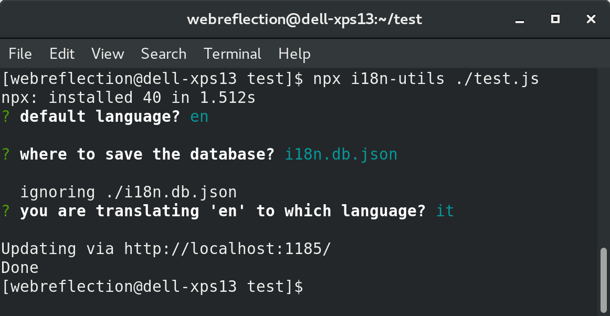
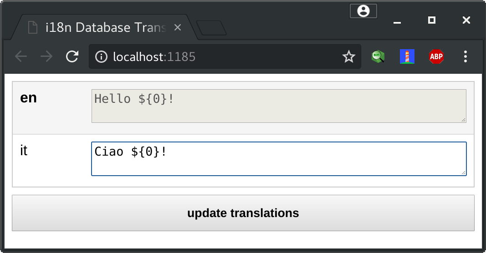

# i18n-utils
The i18n tag function utilitities (WIP)

[](https://github.com/WebReflection/donate) [](https://opensource.org/licenses/ISC)

[Related post](https://codeburst.io/easy-i18n-in-10-lines-of-javascript-poc-eb9e5444d71e).

### Quick Introduction

If you'd like to make your code [i18n](http://www.i18nguy.com/origini18n.html) ready you can use the [i18n-dummy](https://github.com/WebReflection/i18n-dummy) module which provides a noop function tag.

```js
// anywhere you need to write future proof code
// use template literals and put i18n in front
const greetings = i18n`Hello ${user.name}!`;
```

Once you have put the `i18n` function tag in front of all sentences that need translations, you can install this utility and point at the main entry point of your program:

```sh
# you could use -g too
npm install i18n-utils

# if you have latest npm use the binary
npx i18n-utils src/main.js
```

At this point you just need to follow instructions until a browser page opens, giving you all the found sentences that need translation in other languages you've specified.

Once you've translated all languages you can install and use [i18n-yummy](https://github.com/WebReflection/i18n-yummy) function
which expects a runtime locale and a database to use.

Specify both and see that changing locale will produce automatically sentences in the different language.

**test.js** example
```js
// somehow include the client library
const i18n = require('i18n-yummy');

// specify the locale to display
// and the database to use
i18n.locale = 'it';
i18n.db = require('./i18n.db.json');

// write content in the language you used
// as default to setup the database (en)
console.log(i18n`Hello ${'i18n'}!`);
```

Try to save above file as `test.js` and then `i18n-utils ./test.js` providing `it` as translation language and writing `Ciao` instead of `Hello` in the dedicated area.

If you'll `node test.js` after you will see the output will be `Ciao i18n!` instead of `Hello i18n!`.





